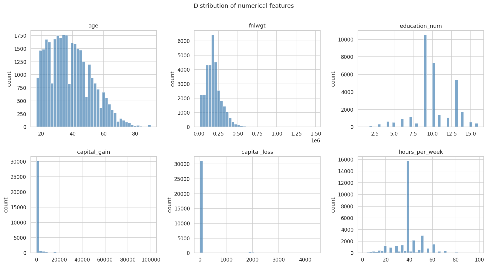
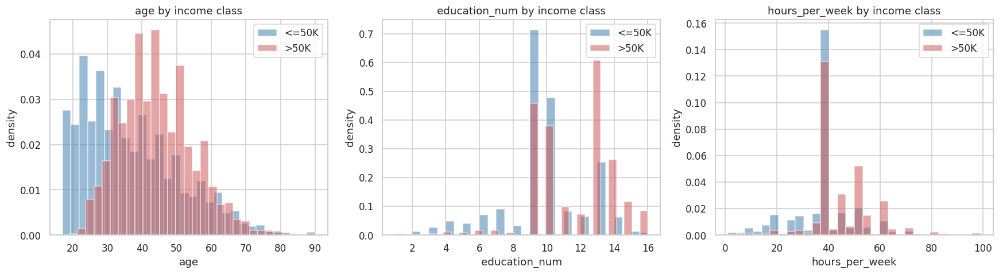
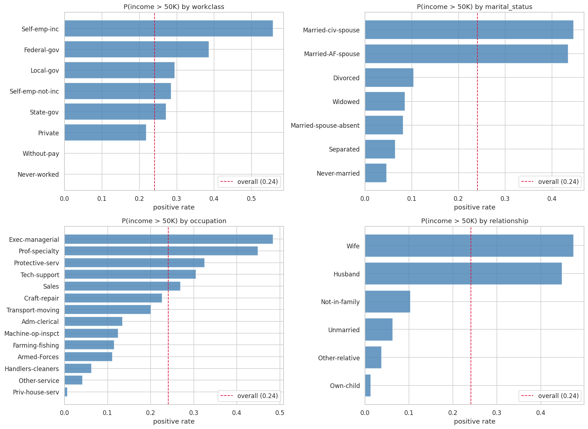
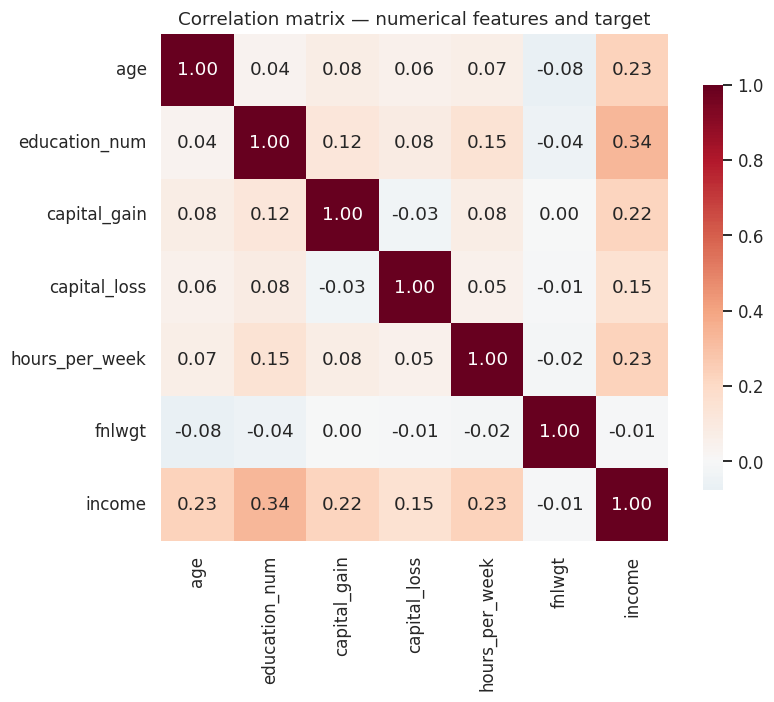
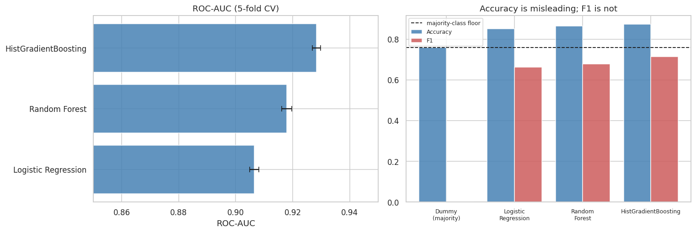
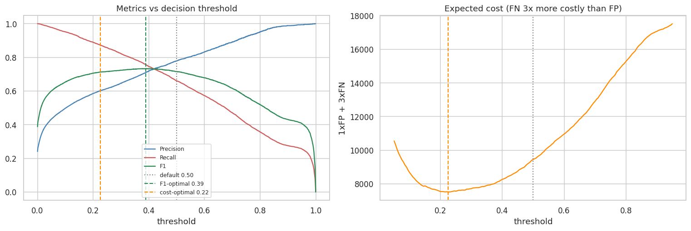
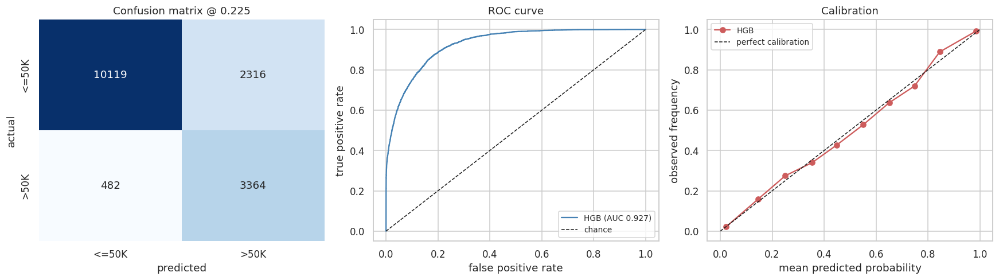
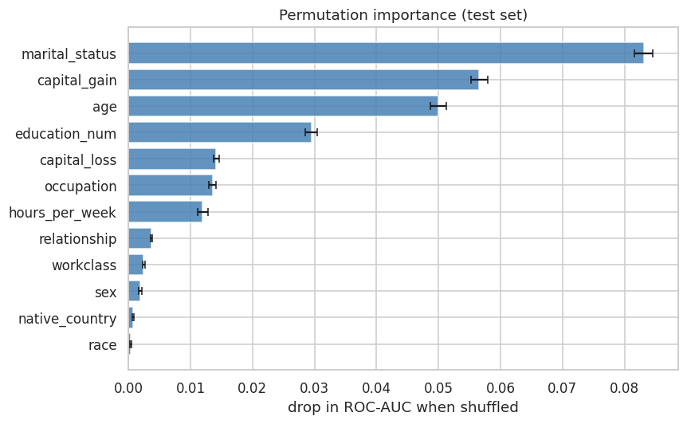
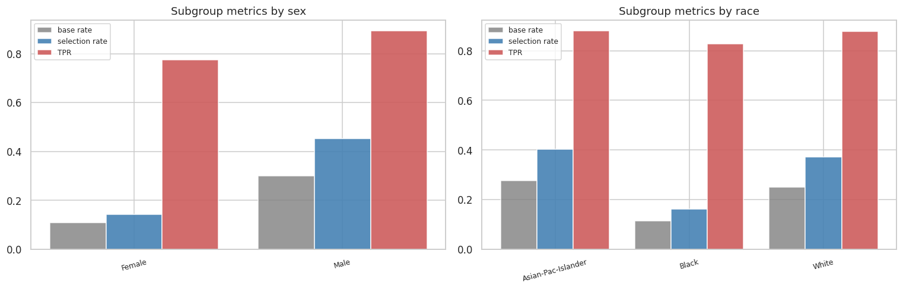
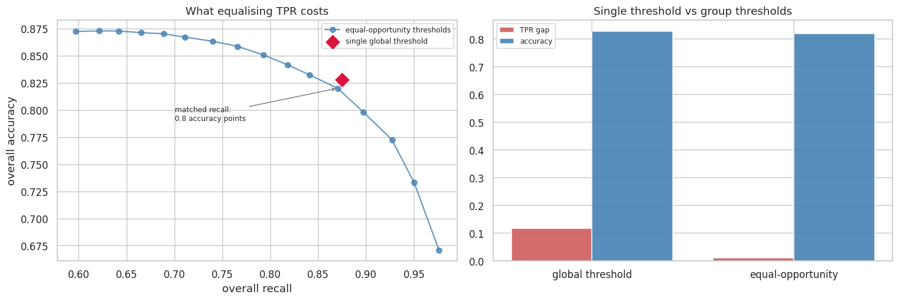

# Predicting Income from US Census Data

Edward (Ned) Pearson

Binary classification on the UCI Adult dataset

## Introduction

Predicting whether a person's income sits above a given threshold is a standard supervised classification problem, and the UCI Adult dataset is one of the most widely used benchmarks for it. The dataset is deliberately familiar. The aim of this project was not to find novel data but to work through a complete and defensible classification pipeline on data where published results exist to compare against.

Three properties of the problem make it more interesting than a straightforward accuracy contest. The target is imbalanced at roughly one positive in four, which means the most obvious metric is actively misleading rather than merely imprecise. Turning model scores into actual decisions requires picking a threshold, and the default value of 0.5 is almost never the right one. The dataset also contains protected attributes alongside other features that act as near perfect proxies for them, which makes it possible to test a common intuition about fairness, watch that intuition fail, and then implement something that works better.

This report details the supervised classification workflow developed to predict whether a surveyed individual earns more than $50,000 USD per year. It covers exploratory data analysis, preprocessing, the development and comparison of four models, hyperparameter tuning, decision threshold selection, bootstrap confidence intervals on all test metrics, and a fairness audit that goes as far as implementing and costing a mitigation. It closes with a critical analysis of the results including limitations and ethical considerations.

The full code is available in the accompanying notebook, `adult_income_classification.ipynb`.

## Definition of task

The task is a supervised binary classification problem where, given a feature vector describing a person surveyed in the 1994 US Census, we should be able to learn a function f such that ŷ = f(x) ∈ {0, 1}, where y = 1 indicates an annual income above $50,000 USD and y = 0 indicates an income at or below that threshold.

This is a classification task because the target variable is a binary label rather than a continuous quantity, and the model is trained on historical census records and evaluated on its ability to generalise to unseen records in a held out test set.

Approximately 24% of records are positive, so the dataset is imbalanced by a ratio of roughly three to one. This imbalance is not severe enough to require resampling, but it is more than sufficient to make accuracy a poor guide to model quality, and it shaped every evaluation decision made below.

### Performance measures

The primary metric for all models created was **ROC-AUC**, which can be interpreted as the probability that a randomly chosen positive case receives a higher score than a randomly chosen negative case. It was selected for model comparison because it is independent of any particular decision threshold. Comparing models at an arbitrary cutoff of 0.5 mixes together two separate things, the quality of the ranking the model produces and the choice of where to cut that ranking, and those two decisions are better made separately.

The secondary metrics were PR-AUC (average precision), precision, recall and F1. PR-AUC is reported alongside ROC-AUC because it ignores true negatives entirely, which makes it more informative when the positive class is rare and the abundant true negatives would otherwise flatter the model.

Accuracy was reported throughout, but only to demonstrate that it is misleading. A model that predicts the majority class for every single record achieves 75.9% accuracy on this dataset while identifying nobody at all. Rather than simply assert this, a baseline classifier that does exactly that was included in the model comparison so the figure appears in the results table alongside everything else.

Models were evaluated using 5-fold stratified cross validation on the training file. The test file was held out entirely and used once, for final evaluation, playing no role in model selection, hyperparameter tuning or threshold selection. All final test metrics are reported with bootstrap 95% confidence intervals, because a point estimate from a single test set hides real sampling uncertainty. As discussed later, those intervals proved to be more than a formality, since they overturned a finding from an earlier draft of this analysis.

## Dataset description

The dataset was extracted from the 1994 US Census database by Barry Becker and is distributed by the UCI Machine Learning Repository. Records were filtered by the dataset authors to individuals aged over 16, with a reported income above zero, a final sampling weight above 1, and more than zero hours worked per week.

The dataset ships with a predefined train and test split, `adult.data` containing 32,561 records and `adult.test` containing 16,281. This canonical split was used rather than generating a fresh random split, because published results on this dataset use it and reproducing it is what makes the figures below comparable to the literature. Two quirks of the test file need handling on load. The first line is a comment rather than a data row, and the income labels in that file carry a trailing full stop that is absent from the training file.

The positive rate differs slightly between the two files, at 24.08% in training and 23.62% in test. This is because the split was made by the dataset authors rather than stratified by a modern library, which is worth keeping in mind because it means the test set is a genuinely separate sample rather than a reshuffle of the same pool.

**Feature summary:**

| Feature | Type | Description |
|---|---|---|
| age | Continuous | Age in years (17 to 90) |
| workclass | Nominal | Employment type, 8 categories, 1,836 missing |
| fnlwgt | Continuous | Census final sampling weight (dropped) |
| education | Nominal | Highest education level, 16 categories (dropped, redundant) |
| education_num | Ordinal | Education level as an integer (1 to 16) |
| marital_status | Nominal | Marital status, 7 categories |
| occupation | Nominal | Occupation type, 14 categories, 1,843 missing |
| relationship | Nominal | Household role, 6 categories |
| race | Nominal | Race, 5 categories |
| sex | Binary | Female (10,771) or Male (21,790) |
| capital_gain | Continuous | Capital gains in USD, 91.7% zero |
| capital_loss | Continuous | Capital losses in USD, 95.3% zero |
| hours_per_week | Continuous | Usual hours worked per week (1 to 99) |
| native_country | Nominal | Country of origin, 41 categories, 583 missing |
| income (the target) | Binary | 1 if above $50K, 0 otherwise |

**Statistical properties of numerical features (training file):**

| Feature | Min | Max | Mean | Median | Std | Skew | r with target |
|---|---|---|---|---|---|---|---|
| age | 17 | 90 | 38.58 | 37 | 13.64 | 0.56 | 0.23 |
| fnlwgt | 12,285 | 1,484,705 | 189,778 | 178,356 | 105,550 | 1.45 | -0.01 |
| education_num | 1 | 16 | 10.08 | 10 | 2.57 | -0.31 | 0.34 |
| capital_gain | 0 | 99,999 | 1,077.65 | 0 | 7,385.29 | 11.95 | 0.22 |
| capital_loss | 0 | 4,356 | 87.30 | 0 | 402.96 | 4.59 | 0.15 |
| hours_per_week | 1 | 99 | 40.44 | 40 | 12.35 | 0.23 | 0.23 |

Missing values are marked with a question mark in the raw files rather than being left blank, and affect only three columns at rates between 1.8% and 5.6%. There are 24 exact duplicate rows in the training file, which is 0.07% of the data. These duplicates were kept rather than dropped, because in a census sample two people can genuinely share identical values across all 14 recorded attributes, and a 25 year old private sector high school graduate working 40 hours a week is not a rare profile. Treating them as data entry errors would require evidence that does not exist in the data.

All exploratory analysis below was performed on the training file only. Inspecting the test set to inform preprocessing choices would be a subtle form of leakage even though no model is fitted during that inspection.

## Exploratory data analysis

### Target balance

The class split of roughly 24% positive to 76% negative is the single most important fact about this dataset for evaluation purposes. A model that unconditionally predicts the negative class scores 75.9% accuracy, so every accuracy figure in this report has to be read against a floor of 0.759 rather than against zero. An 85% accuracy result, which sounds respectable in isolation, is only nine points above a model that does nothing at all.

### Numerical features

**Figure 1:**

*Figure 1: Distributions of the six numerical features in the training file.*

Age is right skewed with a skewness of 0.56, spanning 17 to 90 with most of its mass between 20 and 50. The `fnlwgt` column is more heavily skewed at 1.45 and is examined separately below. The `education_num` column is discrete and multi modal with a large spike at 9 (high school graduate) and 10 (some college). The two capital columns are extreme zero inflated distributions with skewness values of 11.95 and 4.59, which are quantified in the next section. The `hours_per_week` feature has a very sharp spike at exactly 40, as would be expected for a standard full time working week, with secondary clusters at 20 and 50.

**Figure 2:**

*Figure 2: Class conditional densities for age, education_num and hours_per_week. The high income group is shown in red.*

Overlaying the class conditional densities shows how separable each feature is on its own, and Figure 2 revealed the structure that ultimately determined the model choice.

The age distribution for the high income group is shifted to the right and is far more concentrated in the 35 to 55 band. The relationship between age and income is therefore clearly non monotonic, since the probability of high income rises through the thirties and forties and then falls again past retirement age. A linear model cannot represent a relationship of this shape without an explicit quadratic term being engineered in, whereas a tree based model can split on it directly.

The `education_num` feature shows strong separation with the high income group concentrated at 13 (bachelors) and above. The `hours_per_week` feature shows both classes spiking at 40, but with visibly more mass above 40 in the high income group.

No single feature separates the classes cleanly, which is expected and is the reason a model is warranted at all.

### Zero inflation in the capital columns

91.7% of records have a capital gain of exactly zero and 95.3% have a capital loss of exactly zero. On a first pass these look close to constant columns and therefore close to useless, but the non zero minority turns out to be highly predictive. 61.8% of people with any capital gain at all earn above $50K, against 20.7% of those with none, which is a threefold difference in positive rate.

The Pearson correlation of 0.22 between `capital_gain` and the target badly understates this, and the reason it does is informative. The relationship is a step change at zero rather than a linear slope, so a correlation coefficient that measures linear association is the wrong summary for it.

This has a direct consequence for model choice. A linear model has to fit a single coefficient to a variable that is zero 92% of the time and then ranges up to $99,999 in the remainder, which is a poor representation of a relationship that is really "zero or not zero, then a weak slope". A tree based model can split on `capital_gain > 0` directly and then treat the two sides separately. Together with the non monotonic age relationship found in Figure 2, this was the concrete reason to expect tree based models to outperform logistic regression on this dataset, and that expectation is tested in the results section.

### Categorical features

**Figure 3:**

*Figure 3: Probability of income above $50K by category for four categorical features, with the overall base rate marked by the dashed line.*

Plotting the positive rate within each category against the overall base rate shows which categorical features carry signal.

The `marital_status` feature is the strongest single categorical predictor by a wide margin, with `Married-civ-spouse` sitting far above the base rate and `Never-married` far below it. The `relationship` feature shows the same pattern, with `Husband` and `Wife` high and `Own-child` near zero, which is an early hint that the two features are largely redundant with one another. The `occupation` feature separates sensibly, with `Exec-managerial` and `Prof-specialty` at the top and `Priv-house-serv` and `Other-service` at the bottom. The `workclass` feature is weaker overall, although `Self-emp-inc` stands out clearly from the rest.

The strength of `marital_status` deserves scepticism rather than satisfaction. It is very unlikely to be causal in any useful sense. The dataset records individual income rather than household income, and in 1994 a married record was considerably more likely to describe a male primary earner than a female one. The feature is therefore doing demographic proxy work, standing in for household earning structure and, as the fairness audit later shows, for sex. This observation is picked up again in the fairness section, where it turns out to explain the central result.

### Correlation structure

**Figure 4:**

*Figure 4: Correlation matrix for the numerical features and the target.*

The Pearson correlations with the target show `education_num` as the strongest linear predictor at r = 0.34, followed by `age` at 0.23 and `hours_per_week` at 0.23. The `capital_gain` feature comes in at 0.22 despite the much larger effect described above, for the reasons already given.

Inter feature correlations are uniformly low across the matrix. Unlike a dataset dominated by several measurements of the same underlying quantity, there is no multicollinearity problem here, so regularisation was not expected to deliver much benefit to the linear model and no features were dropped on collinearity grounds.

### Two features removed, for different reasons

Checking `education` against `education_num` showed that every education label maps to exactly one integer value, confirming that they are the same variable encoded twice, once nominally and once ordinally. Keeping both would add 15 one hot columns carrying no information at all. The nominal `education` column was therefore dropped and the ordinal `education_num` kept, because education has a genuine ordering that the integer encoding preserves and that one hot encoding would discard.

The `fnlwgt` feature was dropped for a different reason. Its correlation with the target is -0.0095, which is effectively zero, and this is by design rather than by accident. The column is the census final sampling weight, an estimate of how many people in the wider population each row is intended to represent. It describes the sampling process rather than the person, so including it invites the model to fit noise in the survey design, and no amount of predictive signal it might accidentally carry would be interpretable.

### Missingness is informative

| Feature | Missing | Positive rate when missing | Positive rate when present |
|---|---|---|---|
| workclass | 1,836 | 0.104 | 0.249 |
| occupation | 1,843 | 0.104 | 0.249 |
| native_country | 583 | 0.250 | 0.241 |

Records with a missing `workclass` or `occupation` have a positive rate of 0.104, which is less than half the 0.249 rate of records where those fields are present. The two columns are also missing together in almost every case, which is consistent with the missing records describing people who were not working at the time of the survey.

Not being in work is genuinely predictive of lower income, so this missingness is informative rather than random. Imputing these fields with the mode would actively destroy that signal by relabelling non workers as private sector employees, which is why the preprocessing encodes missing categoricals as an explicit `Unknown` category instead. The `native_country` feature shows no such effect, with positive rates of 0.250 and 0.241, but it was handled the same way for consistency.

### A proxy that matters later

Cross tabulating `relationship` against `sex` showed that the two are almost perfectly dependent. Of the 13,193 records labelled `Husband`, 13,192 are male, and of the 1,568 records labelled `Wife`, 1,566 are female.

This means that `sex` is effectively present in the feature set whether or not the `sex` column itself is included. The feature was retained for the main model, but this finding was flagged at the EDA stage and it turns out to be the key to the central fairness result reported later.

## Preprocessing

Each preprocessing step is directly justified by a finding from the EDA above:

* **Drop fnlwgt:** The census sampling weight describes the survey design rather than the individual, and correlates with the target at -0.0095. Dropped.
* **Drop education:** Perfectly redundant with the ordinal `education_num`, since every label maps to exactly one integer. Dropped in favour of the ordinal encoding.
* **Encode the target:** The `>50K` label converted to 1 and `<=50K` to 0, with the trailing full stop stripped from the test file labels first.
* **Median impute numerics:** Applied defensively, since no numerical column actually contains missing values, but included so the pipeline would not fail on unseen data.
* **Unknown category for missing categoricals:** Missing values filled with the constant string `Unknown` rather than the mode, because missingness carries signal (positive rate 0.104 against 0.249).
* **One hot encode categoricals:** Applied to all categorical features, since none of `workclass`, `occupation`, `marital_status`, `relationship`, `race`, `sex` or `native_country` has a meaningful ordering.
* **Pool rare categories:** The encoder was set with `min_frequency=10`, because `native_country` has 41 levels with a long tail and encoding every one of them produces columns that are almost entirely zero.
* **Handle unknown categories:** The encoder was set with `handle_unknown='ignore'` so that a category appearing in the test file but absent from a given training fold does not cause a failure.
* **Standard scaler:** Applied to numerical features for the logistic regression only, so that the L2 penalty applies evenly across features. Tree based models are invariant to monotonic rescaling, so it was skipped for those to avoid pointless computation.

The entire sequence was placed inside a scikit-learn `Pipeline` object rather than being applied to the dataframe before splitting. This is the mechanism that prevents data leakage. When the pipeline is passed to `cross_validate`, the imputer, encoder and scaler are each fitted on the training portion of every fold and then only applied to the validation portion. Fitting a scaler on the full dataset before splitting would allow statistics from held out records to influence training, which inflates every score that follows and does so invisibly.

After preprocessing, the 12 remaining input features (5 numerical and 7 categorical) expand to 91 columns.

## Machine learning models

Four models were developed and evaluated using 5-fold stratified cross validation, with all preprocessing fitted inside each fold as described above. Stratification was used so that each fold preserves the 24.1% positive rate, which removes an avoidable source of variance between folds.

**Model 1 – Dummy Classifier (majority class):**

A classifier that predicts the majority class for every record, included to establish the accuracy floor. This is not filler. It is the control that makes every subsequent accuracy figure interpretable, and its F1 score is the clearest single piece of evidence that accuracy is the wrong headline metric here. Results: **ROC-AUC = 0.5000 ± 0.0000, F1 = 0.0000, accuracy = 0.7592**.

**Model 2 – Logistic Regression:**

A regularised linear model on the full scaled and encoded feature set, serving as the interpretable baseline and as a test of how much of the available signal is linearly separable. Results: **ROC-AUC = 0.9066 ± 0.0016, PR-AUC = 0.7663, F1 = 0.6626, accuracy = 0.8519**.

**Model 3 – Random Forest:**

An ensemble of 300 trees with `min_samples_leaf=5`, capable of capturing the non linear relationships and feature interactions identified in the EDA. Results: **ROC-AUC = 0.9179 ± 0.0018, PR-AUC = 0.8040, F1 = 0.6792, accuracy = 0.8639**.

**Model 4 – Histogram Gradient Boosting:**

A sequentially boosted ensemble, expected to be the strongest of the four given that the EDA identified both a non monotonic relationship (age) and a step change relationship (capital_gain), neither of which a linear model can represent. Results: **ROC-AUC = 0.9284 ± 0.0014, PR-AUC = 0.8293, F1 = 0.7133, accuracy = 0.8728**.

One caveat applies to this comparison and should be stated rather than glossed over. Only the gradient boosting model was subsequently tuned. The logistic regression and random forest ran at fixed and reasonable settings throughout, so what is being compared is a tuned boosting model against two sensible defaults rather than three equally optimised models. Given the roughly two point ROC-AUC gap between the linear model and the boosted one, and given how little tuning moved the boosted model (shown in the next section), it is very unlikely that symmetric tuning would change the ordering. The comparison is nonetheless not symmetric, and a reader should know that.

## Evaluation and model comparison

| Model | ROC-AUC | Std | PR-AUC | F1 | Accuracy |
|---|---|---|---|---|---|
| Model 1 – Dummy (majority) | 0.5000 | 0.0000 | 0.2408 | 0.0000 | 0.7592 |
| Model 2 – Logistic Regression | 0.9066 | 0.0016 | 0.7663 | 0.6626 | 0.8519 |
| Model 3 – Random Forest | 0.9179 | 0.0018 | 0.8040 | 0.6792 | 0.8639 |
| Model 4 – HistGradientBoosting | 0.9284 | 0.0014 | 0.8293 | 0.7133 | 0.8728 |

**Figure 5:**

*Figure 5: Cross validated ROC-AUC with fold standard deviations (left), and accuracy against F1 with the majority class floor marked (right).*

The right hand panel of Figure 5 is the argument about metric choice in a single picture. The dummy classifier's accuracy bar very nearly touches the dashed majority class floor while its F1 bar is invisible at zero. Across the four models accuracy moves from 0.76 to 0.87, an eleven point range which makes a model that identifies nobody look merely mediocre rather than useless. Over the same four models F1 moves from 0.00 to 0.71, which reflects what actually changed.

Ordering the models by ROC-AUC gives HistGradientBoosting at 0.9284, then Random Forest at 0.9179, then Logistic Regression at 0.9066. The boosting model also has the tightest fold to fold standard deviation at 0.0014, so it is both the strongest and the most stable of the three real models.

The roughly two point ROC-AUC gap between logistic regression and gradient boosting is the measurable value of being able to represent non linearity on this dataset, and it is consistent with what the EDA predicted. The non monotonic age relationship and the step change in `capital_gain` are precisely the structures a linear model cannot capture without manual feature engineering.

For external context, a published benchmark on this dataset reports ROC-AUC values of 0.907 for logistic regression, 0.903 for random forest and 0.927 for XGBoost. The results above therefore sit at parity with established figures rather than above or below them, which is the expected outcome and is addressed again in the limitations.

HistGradientBoosting was selected as the model to carry forward.

### Hyperparameter tuning

A grid search over 12 configurations was run using the same 5-fold stratified cross validation, scored on ROC-AUC. The parameters searched were `learning_rate` across [0.05, 0.1], `max_leaf_nodes` across [15, 31, 63] and `min_samples_leaf` across [20, 50], with `l2_regularization` fixed at 1.0. These control the bias variance trade off, with the learning rate and leaf count setting model capacity and the minimum leaf size constraining it.

The best configuration was a learning rate of 0.1, 31 leaf nodes and a minimum of 50 samples per leaf, achieving a cross validated ROC-AUC of **0.9289** against the untuned 0.9284. This is an improvement of 0.0005, which is roughly a third of the model's own fold to fold standard deviation. The worst of the 12 configurations scored 0.9234, giving a total spread across the entire grid of 0.0054.

Tuning therefore did essentially nothing on this dataset, and this is reported as a result rather than hidden. The model is insensitive to these hyperparameters here and the defaults were already close to optimal. This is a useful negative finding rather than a failure, because it says that the remaining error is not a model capacity problem. No amount of further grid searching will recover it, and the limiting factor must be the information content of the 12 available features. That conclusion is revisited in the section on improving performance.

## Threshold selection

Everything to this point evaluates the model's ranking of records. Converting that ranking into actual decisions requires choosing a threshold, and 0.5 is a default value rather than a considered decision. With a 24% positive rate, 0.5 sits close to the threshold that maximises accuracy, which is the metric already rejected as unsuitable.

Thresholds were selected using out of fold predictions generated on the training set by `cross_val_predict`, so that the test set remained untouched. Two candidate operating points were derived.

The first is the **F1 optimal threshold of 0.389**, which is the balanced choice when precision and recall are considered equally important. At this threshold the out of fold F1 is 0.7331 with precision 0.7105 and recall 0.7572, against an F1 of 0.7151 at the default of 0.50.

The second is the **cost optimal threshold of 0.225**, derived by assuming that a false negative is three times as costly as a false positive and minimising the resulting total cost. The reasoning behind the assumption is that if a model of this kind were used to route people toward a benefits programme or a financial product, wrongly excluding an eligible person is worse than the cost of reviewing an ineligible one. At this threshold the out of fold cost is 7,514 against 9,448 at the default of 0.50.

**Figure 6:**

*Figure 6: Precision, recall and F1 against the decision threshold (left), and expected cost under a 3:1 false negative to false positive ratio (right).*

The left panel shows that the precision and recall trade off is steep in the region around the default. The right panel shows that the cost curve is asymmetric and is clearly minimised well below 0.5, so under the stated assumption the default threshold is a materially worse decision rule rather than a neutral starting point. The curve is also fairly flat between roughly 0.17 and 0.30, which means the chosen value is not fragile and small errors in the cost assumption would not greatly change the outcome.

It should be stressed that the 3:1 ratio is an assumption that was stated and then applied, not a quantity measured from the data. A different ratio produces a different threshold, and the threshold should never be quoted without the assumption that generated it.

## Final evaluation on the test set

The tuned model was refitted on the complete training file and evaluated once on the 16,281 held out test records.

**Test ROC-AUC = 0.9273, 95% CI [0.9230, 0.9314]. Test PR-AUC = 0.8255, 95% CI [0.8154, 0.8360].**

| Threshold | Accuracy | Precision | Recall | F1 | FP | FN |
|---|---|---|---|---|---|---|
| Default 0.50 | 0.8732 | 0.7744 | 0.6534 | 0.7088 | 732 | 1,333 |
| F1 optimal 0.389 | 0.8648 | 0.7004 | 0.7470 | 0.7229 | 1,229 | 973 |
| Cost optimal 0.225 | 0.8281 | 0.5923 | 0.8747 | 0.7063 | 2,316 | 482 |

All three thresholds are reported rather than only the most flattering one, because selecting a single row from this table and presenting it as the result would misrepresent the trade off being made.

The cross validated ROC-AUC of 0.9289 and the test value of 0.9273 agree closely, which is the practical evidence that the pipeline is not leaking. A large gap in either direction would indicate a problem, and the small shortfall here is consistent with the test file being a genuinely separate sample rather than a reshuffle of the training pool.

### Bootstrap confidence intervals

Resampling the 16,281 test records with replacement 1,000 times gives an interval for each metric rather than a point estimate.

| Metric | Estimate | 95% CI | Half width |
|---|---|---|---|
| ROC-AUC | 0.9273 | [0.9230, 0.9314] | 0.0042 |
| PR-AUC | 0.8254 | [0.8154, 0.8360] | 0.0103 |
| F1 (at 0.225) | 0.7062 | [0.6962, 0.7173] | 0.0106 |
| Accuracy (at 0.225) | 0.8282 | [0.8226, 0.8340] | 0.0057 |
| Recall (at 0.225) | 0.8746 | [0.8644, 0.8847] | 0.0101 |
| TPR gap, male minus female | 0.1188 | [0.0850, 0.1541] | 0.0345 |

The half width on ROC-AUC of 0.0042 is the number that governs everything that follows. Any later comparison between models or feature sets that differs by less than roughly 0.004 ROC-AUC is not a difference this test set is capable of resolving, and treating it as real would be a mistake. This becomes directly relevant in the fairness section.

The threshold table makes the operating point trade off concrete. Moving from the default of 0.50 down to the cost optimal 0.225 raises recall from 0.653 to 0.875, which means finding 851 more of the 3,846 true high earners in the test set. The price is that false positives rise from 732 to 2,316 and headline accuracy falls from 0.873 to 0.828.

Whether that is a good trade cannot be answered from the data. It follows entirely from the 3:1 cost assumption, which was chosen rather than measured. The honest framing is that the model supplies a calibrated ranking and the threshold is a policy decision belonging to whoever deploys it.

**Figure 7:**

*Figure 7: Confusion matrix at the cost optimal threshold (left), ROC curve (centre) and calibration plot (right).*

The calibration plot on the right of Figure 7 matters more than it might first appear. The points track the diagonal closely across the whole range, which means that when the model outputs a score of 0.25, roughly a quarter of the records receiving that score really are high earners.

This is what makes the threshold analysis legitimate rather than decorative. Choosing an operating point by minimising expected cost only means something if the predicted probabilities correspond to real frequencies. On a badly calibrated model the cost curve would be minimising a quantity that does not correspond to anything, and the resulting threshold would be arbitrary. Gradient boosting happens to be well calibrated on this dataset without any post hoc correction, so no calibration step was required, but this was checked rather than assumed.

## Feature importance

**Figure 8:**

*Figure 8: Permutation importance measured on the test set, showing the drop in ROC-AUC when each column is shuffled.*

Permutation importance measures how far test ROC-AUC falls when a single column is randomly shuffled. It was used in preference to the built in impurity based importance because it is measured on held out data and is not biased toward high cardinality features.

The `marital_status` feature is the most important by this measure, ahead of `capital_gain`, `age` and `education_num`, which is consistent with the EDA findings.

The result worth pausing on sits at the bottom of the chart. Both `sex` and `race` have permutation importance values close to zero, meaning that shuffling either of them barely moves the model's ability to discriminate. The tempting conclusion is that the model therefore does not depend on them in any meaningful way. The next section tests that conclusion directly, and finds it to be false.

## Fairness audit

The model was evaluated separately on subgroups defined by `sex` and `race`, at the cost optimal threshold. Three quantities are reported for each group. The selection rate is the proportion of the group predicted positive. The true positive rate is the proportion of genuinely high income people in the group that the model finds. The false positive rate is the proportion of genuinely lower income people in the group that the model wrongly flags.

Equal selection rates across groups is the criterion known as demographic parity, and equal true positive rates is the criterion known as equal opportunity. The two are mathematically incompatible whenever base rates differ between groups, which they do substantially here, so the purpose of this section is to make the disparity visible and legible rather than to declare one criterion the winner.

| Group | n | Base rate | Selection rate | TPR | FPR | Precision |
|---|---|---|---|---|---|---|
| sex = Female | 5,421 | 0.109 | 0.143 | 0.775 | 0.066 | 0.589 |
| sex = Male | 10,860 | 0.300 | 0.452 | 0.893 | 0.263 | 0.593 |
| race = Asian-Pac-Islander | 480 | 0.277 | 0.402 | 0.880 | 0.219 | 0.606 |
| race = Black | 1,561 | 0.115 | 0.161 | 0.827 | 0.075 | 0.590 |
| race = White | 13,946 | 0.250 | 0.371 | 0.877 | 0.202 | 0.592 |

**Figure 9:**

*Figure 9: Base rate, selection rate and true positive rate by subgroup.*

Men are selected at a rate of 45.2% and women at 14.3%, a gap of 30.9 percentage points. Part of this reflects a real difference in base rates, since 30.0% of men in this sample earn above $50K against 10.9% of women, and a model that ignored that difference entirely would be wrong about the world as it was in 1994.

Base rates do not explain the true positive rate gap, however, and this is the finding that matters. The true positive rate is computed only among people who genuinely do earn above $50K, so a difference of 11.8 percentage points means the model is worse at recognising high earning women than high earning men within the group where the correct answer is identical for both. In practical terms it misses more than one in five genuinely high earning women against roughly one in ten high earning men.

The bootstrap puts that gap at 0.1188 with a 95% confidence interval of [0.0850, 0.1541]. The interval excludes zero comfortably, so this is a real and measurable disparity rather than an artefact of a particular test sample.

Subgroups with fewer than 300 test records were excluded from the table, which removes `Amer-Indian-Eskimo` (311 records in the training file) and `Other` (271), because error rates estimated on samples that small are not trustworthy enough to report. This exclusion is itself discussed in the ethics section.

### Attempt 1: removing the protected attributes

The obvious remedy is to delete `sex` and `race` from the feature set, an approach usually called fairness through unawareness. The permutation importance results suggested this should be close to free, since both features scored near zero.

Three feature sets were compared. The first is the full set. The second removes the two protected attributes. The third also removes `relationship` and `marital_status`, which the EDA showed encode sex almost perfectly. Each variant was compared against the full model using a paired bootstrap, in which the same resampled test set is used to evaluate both models and the difference is computed within each resample. This controls for the fact that both models are being scored on identical records and gives much tighter intervals than comparing two independent confidence intervals would.

| Feature set | ROC-AUC | TPR (F) | TPR (M) | TPR gap | Selection rate gap |
|---|---|---|---|---|---|
| All features | 0.9273 | 0.775 | 0.893 | 0.118 | 0.308 |
| Drop sex and race | 0.9273 | 0.802 | 0.885 | 0.083 | 0.287 |
| Drop sex, race and proxies | 0.8858 | 0.780 | 0.826 | 0.046 | 0.169 |

| Feature set | ROC-AUC cost | 95% CI | TPR gap reduction | 95% CI |
|---|---|---|---|---|
| Drop sex and race | 0.0000 | [-0.0007, 0.0006] | 0.035 | [0.021, 0.049] |
| Drop sex, race and proxies | 0.0415 | [0.0382, 0.0455] | 0.071 | [0.031, 0.116] |

Removing `sex` and `race` costs nothing that this test set can measure. The paired difference in ROC-AUC is 0.0000 with an interval straddling zero, which is a far stronger statement than observing that two rounded numbers look similar. What it buys, however, is small. The true positive rate gap falls by 0.035, leaving 0.083 of the original 0.118 intact, so about 70% of the disparity survives the deletion of the attributes it is defined over.

The reason is the proxy structure identified during the EDA. The model reconstructs sex from `relationship`, where `Husband` is 13,192 of 13,193 male, and from `marital_status`. Deleting the label does not delete the information.

Removing those proxies as well does reduce the gap further, by 0.071 with an interval of [0.031, 0.116], but it costs 0.0415 of ROC-AUC with an interval of [0.0382, 0.0455]. That cost is an order of magnitude larger than the resolution of this test set, so unlike the previous comparison it is unambiguously real, and a residual gap of 0.046 still remains. This is a genuine trade of accuracy against disparity rather than a free improvement.

A note on an earlier version of this analysis is worth including here. When this experiment was first run on an arbitrary random 80/20 split rather than the canonical one, and without the paired bootstrap, it appeared to show the true positive rate gap widening when the proxies were removed, which made for a tidier narrative about unawareness backfiring. That finding did not survive either the canonical split or the paired bootstrap, and it was noise. It is recorded here rather than quietly deleted because the methodological point is more valuable than the tidy narrative. Single split comparisons below the resolution of the test set will produce confident sounding conclusions that are not there, and the only defence is to measure the resolution first.

### Attempt 2: equal opportunity post processing

Deleting features is a blunt instrument, since it degrades the model for everybody in the hope of narrowing a gap between two groups. A better targeted approach leaves the model untouched and changes the decision rule instead, choosing a separate threshold for each group so that the true positive rates are equalised.

Thresholds were derived from the out of fold training predictions, selecting for each group the threshold achieving a given target true positive rate, and were then applied unchanged to the test set. Sweeping the target traces out a frontier of achievable operating points.

**Figure 10:**

*Figure 10: Overall accuracy against overall recall along the equal opportunity frontier, with the single global threshold marked (left), and the two decision rules compared directly (right).*

At the point on the frontier matching the overall recall of the single global threshold, the group specific thresholds are 0.103 for women and 0.251 for men. These drive the true positive rate gap from 0.118 down to 0.011, with a 95% confidence interval of [-0.020, 0.042] that contains zero. The disparity is statistically eliminated rather than merely reduced.

The price is 0.79 percentage points of overall accuracy, with an interval of [0.50, 1.08], and an expected cost under the 3:1 assumption rising from 3,762 to 3,926, an increase of about 4%.

Comparing the two approaches directly is instructive. Feature deletion spent 4.2 points of ROC-AUC to remove roughly 60% of the gap. Post processing removes all of it for well under one point of accuracy, making it around five times more efficient on this data. That outcome is what should be expected on reflection, because the model's ranking of individuals was never the source of the problem. The problem was applying a single shared cutoff to two groups whose score distributions differ, and the fix that addresses the actual mechanism is far cheaper than the fix that does not.

One serious caveat has to accompany this result. Applying a lower threshold to women than to men is explicit disparate treatment, because sex is being used directly as an input to the decision rather than merely being correlated with it. In many jurisdictions this is unlawful in credit, employment and housing contexts regardless of the fairness justification offered for it, and US case law is actively hostile to the practice. Presenting group specific thresholds as a clean solution would therefore be misleading. The accurate summary is that the statistical problem is solvable cheaply and the legal and normative problem is not solved by the same move.

## How to improve performance

* **Richer features rather than further tuning:** Tuning moved ROC-AUC by 0.0005 and the entire 12 configuration grid spans only 0.0054, which means the ceiling is set by what the 12 available columns contain. Industry, region, job tenure, firm size and household context are all absent from this dataset and are all well established determinants of earnings. Adding any of them would do more than any amount of additional searching.
* **Symmetric tuning across model families:** Only the boosting model was tuned, so the comparison measures a tuned model against two defaults. Tuning all three would make the comparison a fair one even though the ordering is unlikely to change.
* **Monotonic constraints:** Features whose direction is known in advance, such as `education_num` and `hours_per_week`, could be constrained to monotonic relationships. This would improve interpretability and most likely generalisation, at very little cost to fit.
* **A measured cost ratio:** Both the chosen threshold and the quoted cost of the fairness mitigation follow directly from the assumed 3:1 ratio. Obtaining real costs from an actual deployment context would improve decision quality more than any modelling change.
* **Extending the mitigation:** The equal opportunity thresholds were fitted for sex only. Extending them to race, or to intersections of sex and race, would be a harder and more realistic version of the same problem, since those subgroups are much smaller and the threshold estimates correspondingly less stable.

The performance ceiling found in testing was a ROC-AUC of roughly 0.93, and the remaining error reflects information that is simply absent from the dataset. No further feature engineering on these 12 columns is likely to overcome that.

## Limitations

* **The data is from 1994 and cannot be redeployed:** The $50,000 threshold is not inflation adjusted and corresponds to roughly $107,000 in 2025 terms. Occupational structure, female labour force participation and the relationship between education and earnings have all shifted substantially in the intervening three decades. Every figure in this report describes the 1994 US labour market and nothing else.
* **The performance ceiling is a data limitation rather than a model one:** This is demonstrated by the tuning result and by the small gap between the linear and boosted models, but it also means the project cannot demonstrate improvement beyond a point that was reached early.
* **Only one model family was tuned:** The comparison is between a tuned gradient boosting model and two models at fixed settings, so it is not a symmetric algorithm comparison.
* **The cost ratio is asserted rather than derived:** The cost optimal threshold of 0.225, the recall of 0.875 that follows from it, and the quoted 4% cost increase from the mitigation all depend on the 3:1 assumption.
* **The most important feature is almost certainly not causal:** The `marital_status` feature is doing proxy work for household earning structure and for sex. The model's accuracy depends heavily on a correlation that would be indefensible as a justification for any decision about an individual.
* **The mitigation was fitted for sex only:** Extending equal opportunity thresholds to race or to intersectional subgroups would face far smaller groups and much less stable estimates, and was not attempted.
* **Records are treated as independent:** The census sampling design that `fnlwgt` encodes means records are not drawn uniformly from the population. Dropping that column was the right decision for prediction, but it does mean the evaluation describes performance on the sample rather than on the US population.
* **Subgroup exclusions:** Two racial subgroups were excluded from the fairness table for being too small to estimate reliably, which means the audit is silent about precisely the groups most likely to be poorly served.

## Ethical considerations and professional responsibilities

* **The model measurably underperforms for women:** At the chosen operating point it correctly identifies 77.5% of high earning women against 89.3% of high earning men, and the confidence interval on that gap excludes zero. If a model of this kind gated access to credit, housing or a programme, that gap is a disparate impact affecting people for whom the correct answer is identical.
* **Unawareness is not a defence:** The experiment above shows that deleting `sex` and `race` removes only about a third of the disparity while costing nothing. Any system that omits protected attributes and claims neutrality on that basis is making a claim this analysis directly contradicts, and the claim is easy to test.
* **Mitigation is possible but neither costless nor uncomplicated:** The statistical gap can be closed for under a point of accuracy, but only through a rule that treats people differently on the basis of sex, which is legally fraught in exactly the domains where such a model might be used. That choice is a normative and legal one and the data cannot make it.
* **The model encodes 1994 inequality as prediction:** The disparities it reproduces were present in the training data because they were present in the labour market. A model that learns them and applies them forward converts a historical description into a prospective judgement about individuals, which is a category error with real consequences for the people judged.
* **Rare subgroups receive unreliable predictions:** The subgroups excluded from the audit for being too small are the same ones least represented in the data, which means the groups most likely to be poorly served are also the ones whose error rates are least measurable. This is a failure mode that conceals itself, and reporting overall metrics without a subgroup breakdown would hide it entirely.
* **Professional responsibilities:** This dataset is a benchmark for methodology and not a foundation for deployed decisions about people. Any real system in this space would need current data, documented subgroup performance, a stated and defensible cost ratio, meaningful human review of individual decisions, and scheduled retraining as conditions change.

## Conclusion

A supervised classification workflow was developed to predict whether an individual surveyed in the 1994 US Census earns above $50,000 per year. Four models were compared under 5-fold stratified cross validation using the dataset's canonical train and test split, with all preprocessing contained inside a leakage safe pipeline. Histogram gradient boosting was selected as the best model, achieving a test ROC-AUC of 0.9273 with a 95% confidence interval of [0.9230, 0.9314] and a PR-AUC of 0.8255, against a majority class baseline of 0.5 ROC-AUC and 75.9% accuracy.

Four findings from this process are worth carrying forward.

The first is that accuracy is the wrong metric on this dataset, and the dummy classifier demonstrates it rather than the point simply being asserted. A model achieving 75.9% accuracy with an F1 of exactly zero makes the case in a single table row.

The second is that the decision threshold is a choice rather than a default. Moving from 0.50 to a cost justified 0.225 raised recall from 0.653 to 0.875 while tripling the number of false positives. Which of those operating points is correct depends on a cost assumption that the data cannot supply, and the threshold should not be quoted without it.

The third is that fairness through unawareness is nearly free and nearly useless here. Removing `sex` and `race` costs no accuracy that this test set can measure, with a paired ROC-AUC difference of 0.0000 and an interval of [-0.0007, 0.0006], but it removes only about a third of the true positive rate gap because `relationship` and `marital_status` reconstruct the information that was deleted.

The fourth is that changing the decision rule is far more efficient than removing features. Equal opportunity thresholds eliminated the true positive rate gap, leaving a residual of 0.011 with an interval containing zero, at a cost of 0.79 accuracy points. Feature deletion spent 4.2 points of ROC-AUC to remove only 60% of the same gap.

The performance ceiling on this dataset is set by the features available rather than by model capacity, as shown by a grid search that moved ROC-AUC by 0.0005 across 12 configurations. The bootstrap confidence intervals were also not decorative, since they overturned a confident finding from an earlier draft of this analysis that turned out to be sampling noise.

## References

Barocas, S., Hardt, M., & Narayanan, A. (2023). *Fairness and Machine Learning: Limitations and Opportunities*. MIT Press. https://fairmlbook.org

Becker, B., & Kohavi, R. (1996). *Adult* [Dataset]. UCI Machine Learning Repository. https://doi.org/10.24432/C5XW20

Hardt, M., Price, E., & Srebro, N. (2016). Equality of opportunity in supervised learning. *Advances in Neural Information Processing Systems*, 29.

Pedregosa, F., Varoquaux, G., Gramfort, A., Michel, V., Thirion, B., Grisel, O., ... & Duchesnay, E. (2011). Scikit-learn: Machine learning in Python. *Journal of Machine Learning Research*, 12, 2825-2830.

Saito, T., & Rehmsmeier, M. (2015). The precision-recall plot is more informative than the ROC plot when evaluating binary classifiers on imbalanced datasets. *PLOS ONE*, 10(3), e0118432.
